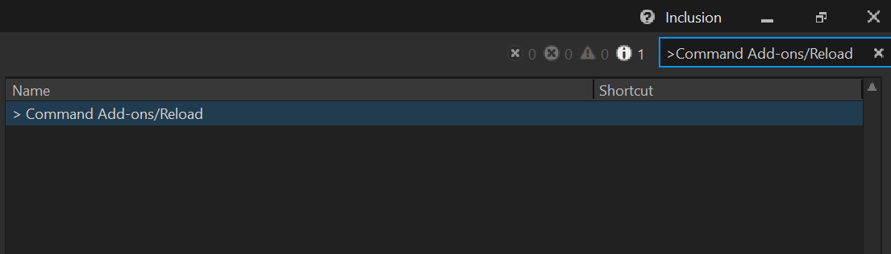
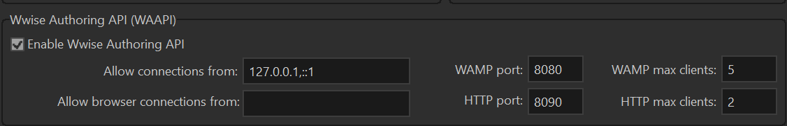

# Wwise Authoring Tools

A collection of tools and scripts for Wwise 

## Overview

This repository contains scripts for the Wwise Authoring Tool.\
The purpose of these scripts is to automate some tasks in the editor to personalize and improve the workflow.

Each script contains information about what it does as comments.

## Prerequisites

- [Python 3.x ](https://www.python.org/downloads/)
- Several Python packages are required, including waapi. Use `Add-ons/install_dependencies.sh` to install them.

## How to use

There are several ways to integrate these scripts into your Wwise project.\
The easiest way is to copy the `Add-ons` folder inside your project.

Your project will then load the scripts automatically the next time you open it.\
Alternatively, if your project is already open go to the top right search bar and type `>Command Add-ons/Reload`.

\
For more information and alternative ways to integrate these scripts, please see Wwise official documentation:

https://www.audiokinetic.com/en/public-library/2024.1.9_8920/?source=SDK&id=waapi.html \
https://www.audiokinetic.com/en/public-library/2024.1.9_8920/?source=SDK&id=defining_custom_commands.html

### About Waapi network connections

These scripts use the default Waapi network connection: 

`WAAPI_URL : str = "ws://127.0.0.1:8080/waapi"`

If you want to use a different connection, you can change the value of the variable `WAAPI_URL` in the script.\
Make sure it matches the URL of your Waapi server on Project > User Preferences > Wwise Authoring API (WAAPI):

\
